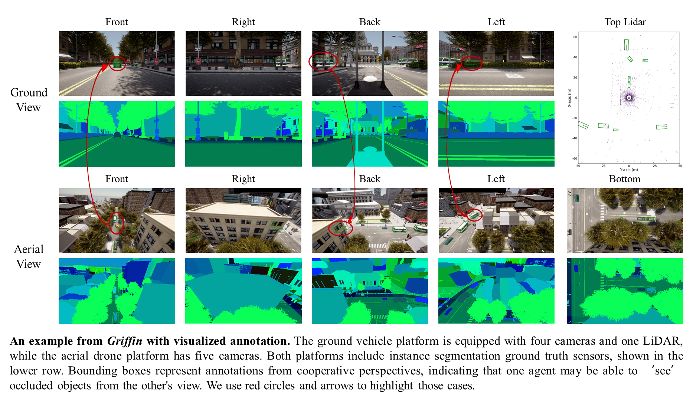
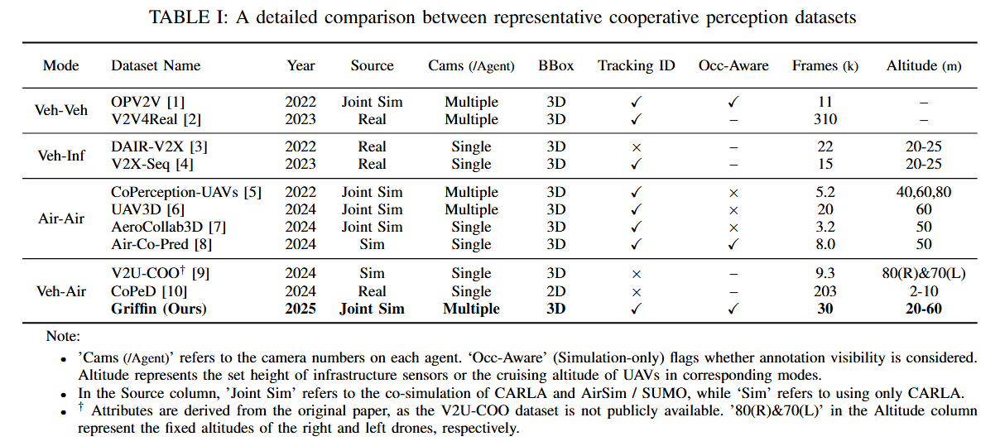

# Griffin: The First Open-Source Aerial-Ground Cooperative 3D Perception Dataset and Benchmark



**Griffin** is the pioneering publicly available dataset for aerial-ground cooperative 3D perception. Built using CARLA-AirSim co-simulation, it features over 200 dynamic scenes—totaling more than 30,000 frames and 270,000 images. With instance-aware occlusion quantification, variable UAV altitudes (20–60 meters), and realistic drone dynamics under diverse conditions, Griffin sets a new standard for cooperative perception research.



---

## News

- 🚀 **(2025/3)** Released source code and pre-trained models for the **AGILE framework**—the first Aerial-Ground Instance-LEvel intermediate fusion framework.
- 📦 **(2025/3)** Griffin V1.0 dataset is now available on [Baidu Netdisk](https://pan.baidu.com/s/1NDgsuHB-QPRiROV73NRU5g?pwd=u3cm).

---

## Getting Started

- [Installation](docs/Installation.md)
- [Dataset Preparation](docs/Dataset_Preparation.md)
- [Training and Evaluation](docs/Training_and_Evaluation.md)
- [Visualization](docs/Visualization.md) [](docs/video/Griffin_r1200_10fps_1_3Mbps.mp4)

---

## Main Results

### Detection and tracking on Griffin-25m under various latency conditions

| **Fusion Stage** | **Method** | **Latency (ms)** | **AP** ↑ | **ATE** ↓ | **AOE** ↓ | **AMOTA** ↑ | **AMOTP** ↓ | **MT** ↑ | **ML** ↓ | **IDS** ↓ | **Comm. Cost** ↓ |
|------------------|------------|------------------|----------|-----------|-----------|-------------|-------------|----------|----------|-----------|------------------|
| No Fusion        | -          | 0                | 0.366    | 0.398     | 0.492     | 0.363       | 1.295       | 16       | 49       | 5         | 0                |
|                  |            |                  |          |           |           |             |             |          |          |           |                  |
| Early Fusion     | Concat     | 0                | 0.626    | 0.385     | 0.795     | 0.653       | 0.869       | 34       | 16       | 38        | ~3×10⁸           |
|                  |            | 200              | 0.510    | 0.502     | 0.776     | 0.561       | 1.044       | 25       | 21       | 34        |                  |
|                  |            | 400              | 0.416    | 0.522     | 0.714     | 0.418       | 1.189       | 19       | 32       | 26        |                  |
|                  |            |                  |          |           |           |             |             |          |          |           |                  |
| Instance Fusion  | AGILE      | 0                | 0.412    | 0.484     | 0.708     | 0.435       | 1.130       | 21       | 35       | 23        | ~6×10⁵           |
|                  |            | 200              | 0.396    | 0.484     | 0.705     | 0.410       | 1.165       | 16       | 36       | 20        |                  |
|                  |            | 400              | 0.373    | 0.505     | 0.709     | 0.366       | 1.212       | 15       | 40       | 12        |                  |
|                  |            |                  |          |           |           |             |             |          |          |           |                  |
| Late Fusion      | Hungarian  | 0                | 0.377    | 0.357     | 0.511     | 0.369       | 1.078       | 14       | 55       | 16        | ~1×10⁴           |
|                  |            | 200              | 0.363    | 0.362     | 0.498     | 0.357       | 1.060       | 15       | 55       | 11        |                  |
|                  |            | 400              | 0.339    | 0.350     | 0.458     | 0.310       | 1.129       | 15       | 58       | 11        |                  |

### Performance Across UAV Altitudes

| **Dataset**    | **Fusion Stage** | **AP**         | **AMOTA**      |
|----------------|------------------|----------------|----------------|
| Griffin-25m    | No Fusion        | 0.366          | 0.363          |
|                | Early Fusion     | 0.626 (+71.0%) | 0.653 (+79.9%) |
|                | Instance Fusion  | 0.412 (+12.6%) | 0.435 (+19.8%) |
|                | Late Fusion      | 0.377 (+3.0%)  | 0.369 (+1.7%)  |
|                |                  |                |                |
| Griffin-40m    | No Fusion        | 0.351          | 0.371          |
|                | Early Fusion     | 0.495 (+41.0%) | 0.543 (+46.4%) |
|                | Instance Fusion  | 0.359 (+2.3%)  | 0.397 (+7.0%)  |
|                | Late Fusion      | 0.354 (+0.9%)  | 0.387 (+4.3%)  |
|                |                  |                |                |
| Griffin-Random | No Fusion        | 0.465          | 0.491          |
|                | Early Fusion     | 0.580 (+24.7%) | 0.646 (+31.6%) |
|                | Instance Fusion  | 0.408 (-12.3%) | 0.426 (-13.2%) |
|                | Late Fusion      | 0.375 (-19.4%) | 0.394 (-19.8%) |

Detailed results with all metrics are lised in [docs/detailed_results.csv](docs/detailed_results.csv).

---

## Citation

If you find Griffin useful, please consider giving a ⭐ and citing our work (details coming soon):
    ```
    TBD
    ```

---

## Acknowledgement

We're grateful to these amazing open-source projects:
- [mmdet3d](https://github.com/open-mmlab/mmdetection3d): Core 3D detection framework.
- [UniV2X](https://github.com/AIR-THU/UniV2X): Cooperative perception inspiration (by our team).
- [BEVFormer](https://github.com/fundamentalvision/BEVFormer): 3D Object Detection Baseline.
- [AB3DMOT](https://github.com/xinshuoweng/AB3DMOT): 3D Multi-Object Tracking Baseline.
